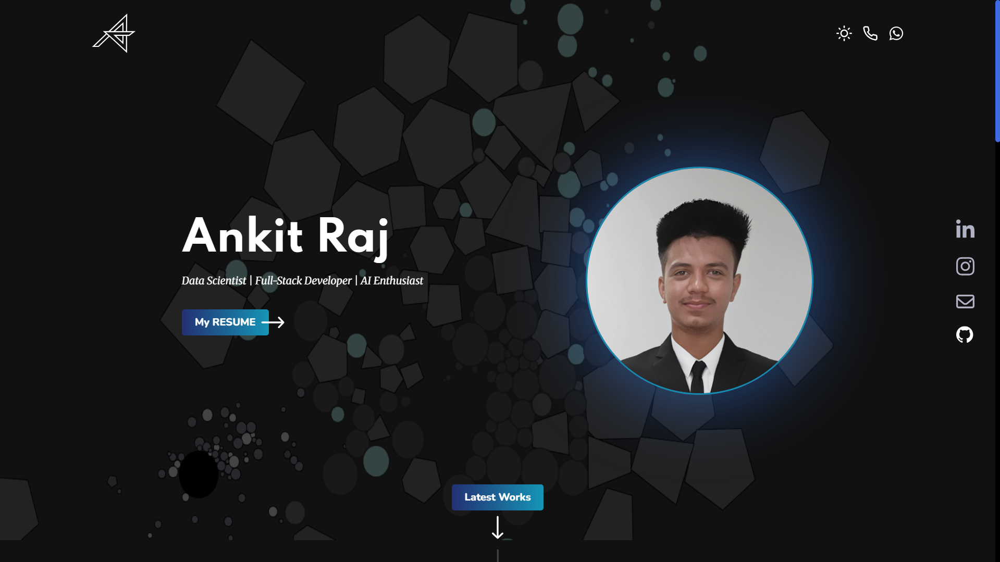

# Portfolio

Welcome to my dynamic portfolio powered by Matter.js, a 2D physics engine that brings motion and realism to web elements. This project blends creativity with physics-based animation to offer an engaging and interactive user experience.

🌌 Interactive Portfolio Built with Matter.js
Welcome to my dynamic portfolio powered by Matter.js, a 2D physics engine that brings motion and realism to web elements. This project blends creativity with physics-based animation to offer an engaging and interactive user experience.

🛠️ Features:
Physics-Driven Animations: Objects on the screen respond to gravity, collisions, and user interaction in real time.

Interactive Elements: Click, drag, and interact with portfolio components like project cards and navigation buttons.

Custom Physics World: Designed a custom Matter.js environment to reflect my personal aesthetic while maintaining fluid performance.

Responsive Design: Fully optimized for desktops, tablets, and mobile devices.

Seamless Integration: Combined with vanilla JavaScript/React for modularity and control over components.

🚀 Why Matter.js?
Using Matter.js allowed me to step away from static design and create something that reflects both technical skill and creative vision. It demonstrates not only my ability to build interactive front-end applications, but also my interest in pushing boundaries with web technologies.
